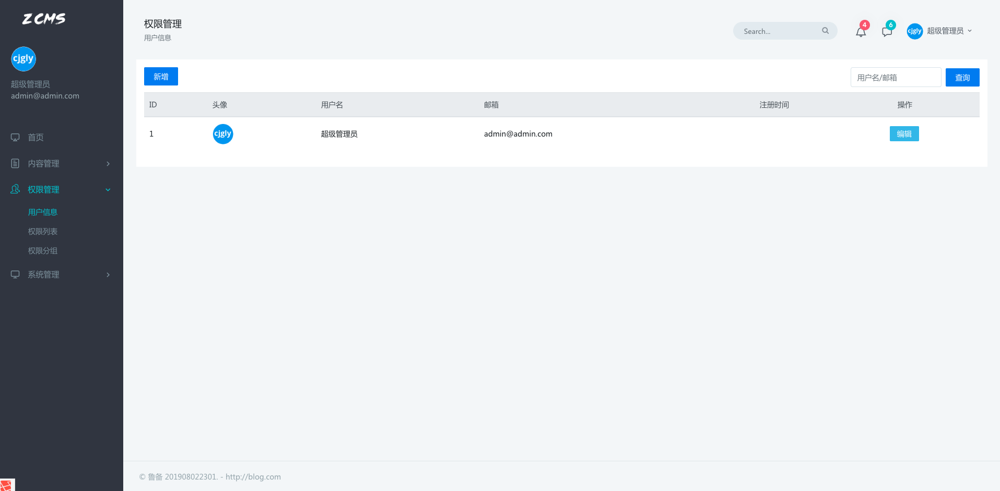
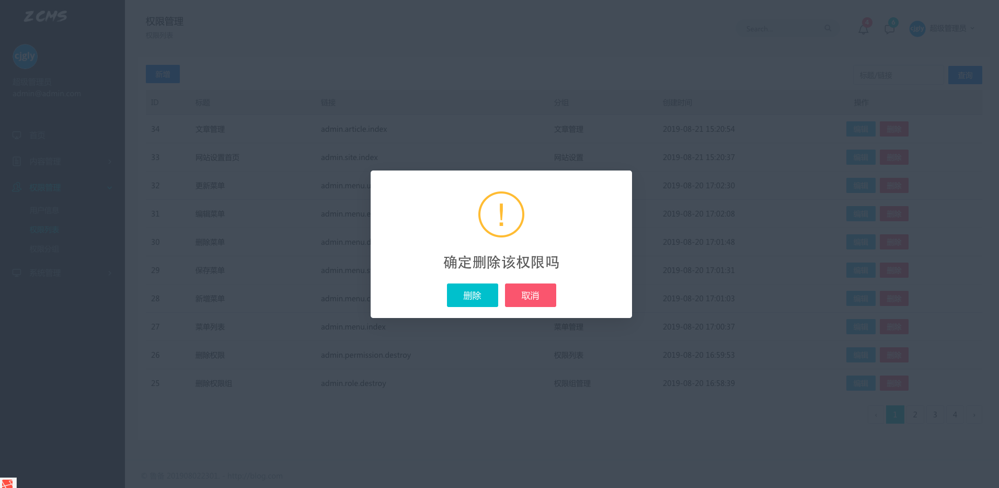
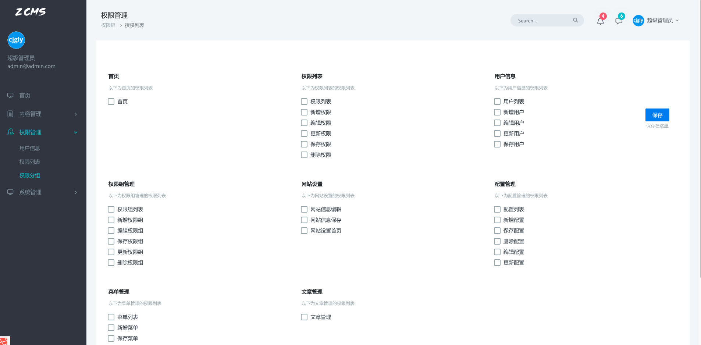

 
 
 
# zcms
基于laravel5.8开发的小型CMS系统，只保留基本功能，深度解耦，适合小项目的二次开发


## 项目截图

 
 
 
 
 
## 要求

php >=7.1

mysql 5.7

npm

reids 等请根据需要切换

## 安装
> 下载

```$xslt
  git clone https://github.com/zhuxiaojin/zcms.git
```  
> 安装依赖，推荐composer源切换为阿里

```
  composer update
```
> 复制.env.example -> .env,修改为环境的实际配置

```$xslt
  php artisan migrate
```  
>填充基本数据,该命令只能执行一次，重复执行之前，请清库！

```$xslt
php artisan db:seed
```
>重新生成密钥

```$xslt
php artisan key:generate
```
## 注意
>前端使用了scss编译，本站样式请存放于site.scss文件中，不要去修改其他样式文件

## 使用
详见内部markdown

## 后台地址

/admin/login

## 默认账号
admin@admin.com 111111

## 开发人员

朱晓进，路伟，夏伟，芮兴龙，于志远，王凤娇
 
